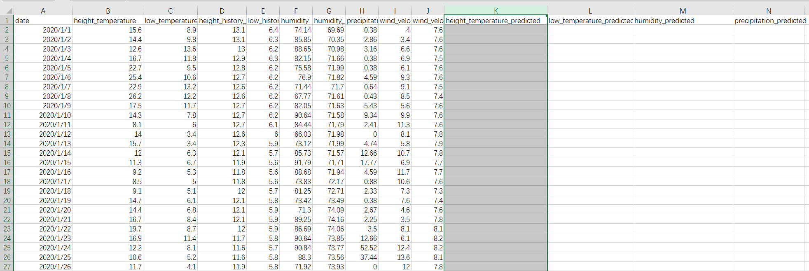
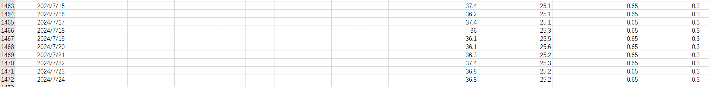

**数据获取源以all_in_one_predicted.csv表为准，不要使用all_in_one_processed.csv**

注意带_predicted(预测)后缀的全部是预测数据，不带的全部是真实数据

**有真实数据的日期不含有预测数据，有预测数据的日期不含真实数据**

日期格式yyyy/MM/dd

----

可预测的数据有四条(即csv表最后的表头)：

height_temperature_predicted(最高温预测)

low_temperature_predicted(最低温预测)

humidity_predicted(湿度预测)

precipitation_predicted(降水量预测)